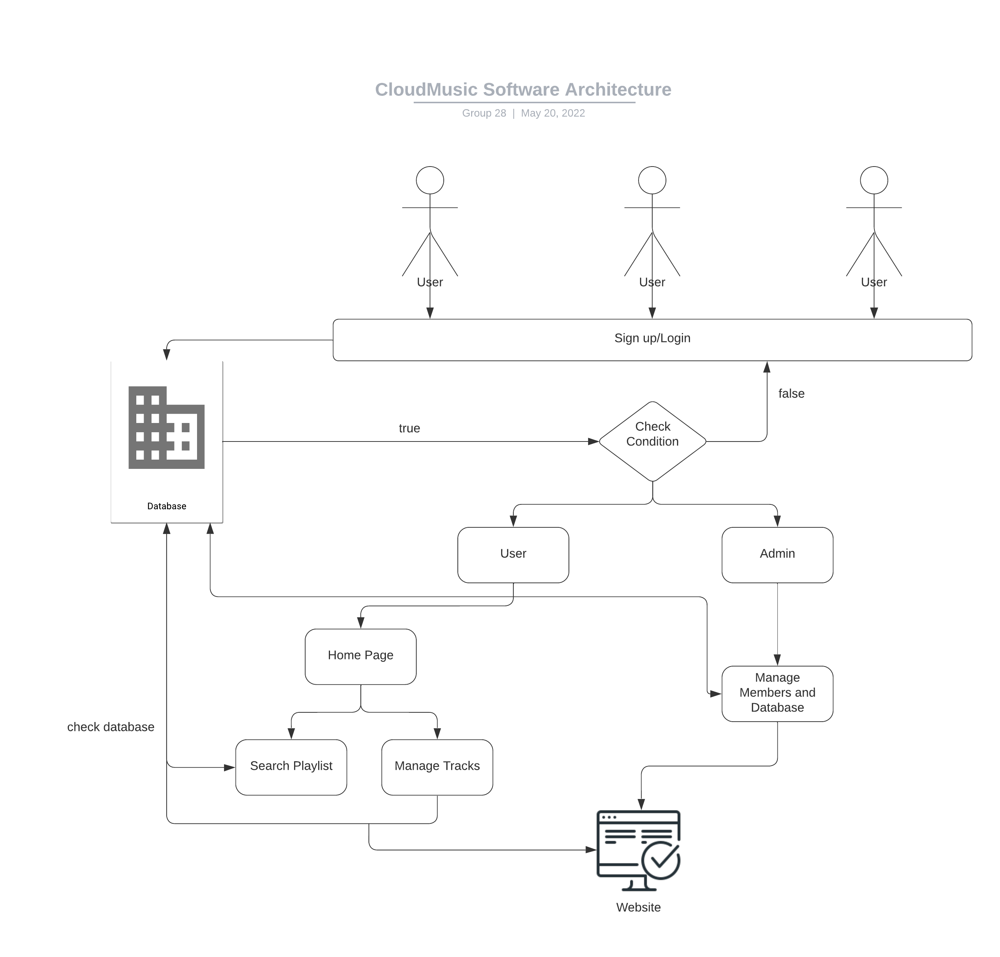
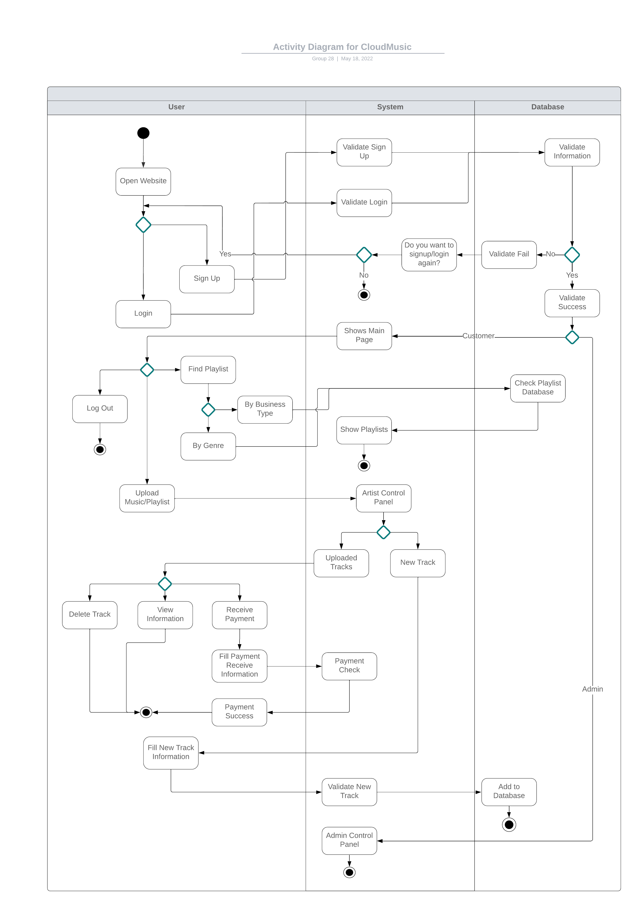

<h1>Welcome to CloudMusic!</h1> 

This is a group project that I made with my team at RMIT University.  
Link: https://cloudmusic68.herokuapp.com/solmusic.vn/home/v1.php  

<h2>1/ Product description</h2>

The goal of our project is to create a website that delivers lawfully copyrighted music to businesses and organizations that use music in their operations. “CloudMusic” will be the name of our website. “CloudMusic” offers a secure, transparent, and copyright-compliant music service, as well as publicity and delivery alternatives for musicians. In addition, our website sells copyrighted music and provides a list of tracks under contract to third-party clients such as service companies, restaurants, hotels, cafés, and individual customers.   

<h2>2/ Notable Product Properties</h2>
Functionality:  
- User Login/Sign Up: customers can use our website freely, but they can sign up for more functions such as searching and using music playlists. 
- Playlist search: customers can search for their suitable playlist, by genre, artists, or albums.  
- Add playlists: customers can add tracks to their playlists  
- Manage tracks: artists can manage their music tracks and playlists on our database and receive monthly reports on the use of their songs.  
- Earning: artists can earn their income automatically monthly by providing their payment account.  

<h2>3/ Software Architecture</h2>
  

<h2>4/ Activity Diagram</h2>

